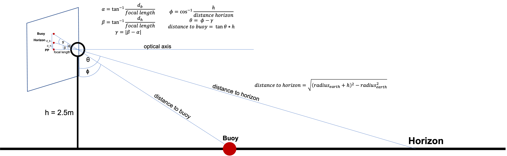

# Man over board tracking

This repository concerns the tracking of a buoy in sea based on a shaky video recording.

In order to run the project properly we must have the video of the buoy with the name `MAH01462.MP4` in the directory.

First of all we must calibrate the video and remove distortion with it. This can be done with the file [camera_calibration.m](./camera_calibration.m) which outputs the file `calibrated_video.avi`.

The next step is to stabilize the video with the script [stabilizing.m](./stabilizing.m) that outputs the file `stabilized_video.avi`. 

This is used in the script [point_tracker.m](./point_tracker.m) to track the buoy and measure the distance to it. The final video is called `tracked_buoy.avi`.

### Distance measuring
The distance measuring to the buoy is based on the following:

